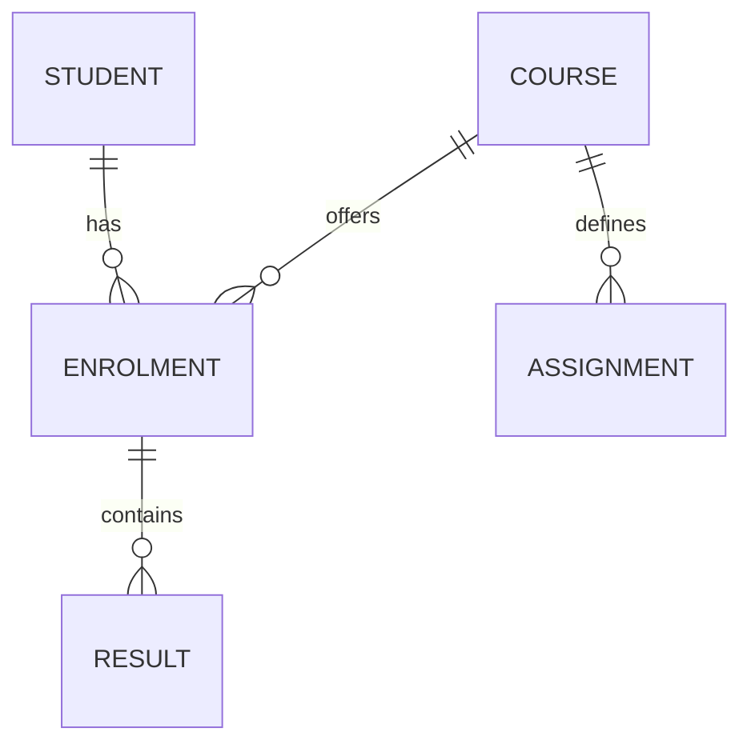
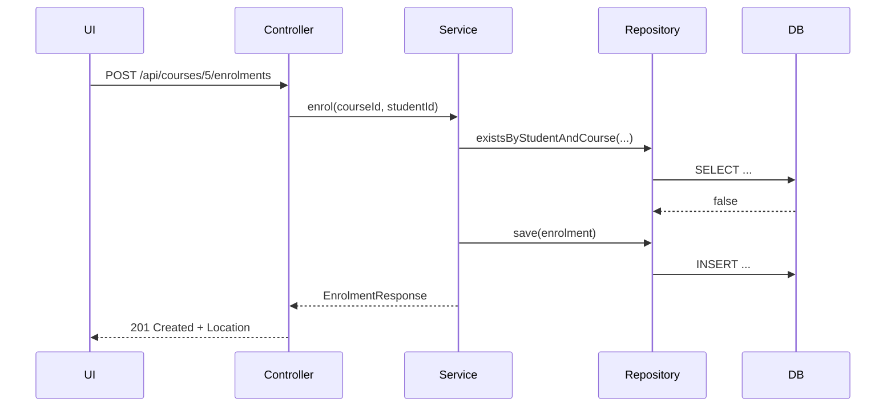

# 09 — Documentation in English

**Outcome ÕV9** — *dokumenteerib loodud rakendused inglise keeles*
Prerequisites: guides 01–08

---

## Why this matters

Documentation is a deliverable, not an afterthought. The test is simple:

> **A competent developer who has never seen this project must be able to run it and understand the
> domain within 15 minutes, using only the repository.**

And the UI module builds against your API, so your documentation is their specification.

---

## 1. `README.md` — the front door

```markdown
# KursusePunkt

Backend for a course-and-grade management system: courses, students, enrolments,
weighted grading and reporting. REST API consumed by the KursusePunkt UI module.

## Features
- Course and student management
- Enrolment with prerequisite validation
- Pluggable grading strategies (weighted, best-of-N, pass/fail)
- Automatic late-submission penalties
- Course reports with grade distribution

## Tech stack
Java 26 · Spring Boot 4.1 · Hibernate 7 · PostgreSQL 16 · Flyway 12 · Maven

## Getting started
### Prerequisites
Docker. Nothing else — the build, the application and the database all run in containers.

### Run
```bash
git clone https://github.com/<you>/kursusepunkt.git
cd kursusepunkt
make dev-docker              # database + application, both containerised
```
The API is then at http://localhost:8080/api and Swagger UI at
http://localhost:8080/swagger-ui.html

## Configuration
| Variable | Default | Description |
|---|---|---|
| `DB_URL` | `jdbc:postgresql://localhost:5432/kursusepunkt` | Database URL |
| `DB_USER` | `app` | Database user |
| `DB_PASSWORD` | `app` | Database password (never commit a real one) |
| `GRADING_PASS_MARK` | `50.0` | Minimum passing grade |

## Running the tests
```bash
make test                    # unit + slice tests, formatting, coverage gate
open target/site/jacoco/index.html
```

## Architecture
[diagram]
One paragraph on the layering.

## Domain model
[ER diagram]

## API
Generated OpenAPI: `docs/openapi.json` · interactive: `/swagger-ui.html`

## Project status and known limitations
- Grade recalculation is synchronous; a course with >5 000 enrolments blocks the request
- No soft delete: removing a course removes its enrolments
- Single-instance only — the study-plan cache is in-memory

## Author and licence
```

**Known limitations** is the section most often skipped and the one reviewers value most. Honesty about
what is unfinished reads as professional, not weak.

---

## 2. Javadoc on the domain's public API

Not on getters. Document the **contract** and the **why** — the *what* is already in the signature.

```java
/**
 * Calculates the final grade for an enrolment using the course's grading strategy.
 *
 * <p>Results with zero weight are ignored. The returned value is rounded to one decimal place
 * using HALF_UP, matching the institution's grading regulation §4.2. Late submissions have
 * already had their penalty applied by {@link SubmissionService}; this method does not apply
 * penalties itself.
 *
 * @param enrolment the enrolment to grade; must have a persisted course
 * @return the final grade, between 0.0 and 100.0 inclusive
 * @throws UnknownGradingStrategyException if the course names a strategy that is not registered
 * @throws IllegalArgumentException        if the total weight of the results is zero
 */
public BigDecimal finalGrade(Enrolment enrolment) { ... }
```

The second paragraph is what makes this worth writing: it answers the question a reader actually has
("does this apply the late penalty too?"), which no signature can.

Run `make mvn ARGS=javadoc:javadoc` and fix every warning. Missing `@param` tags are warnings for a reason.

---

## 3. OpenAPI

```xml
<dependency>
  <groupId>org.springdoc</groupId>
  <artifactId>springdoc-openapi-starter-webmvc-ui</artifactId>
</dependency>
```

Annotate so the generated page is readable rather than a bare list of paths:

```java
@Operation(summary = "Enrol a student in a course",
           description = "Fails with 409 if the student is already enrolled or the course is full.")
@ApiResponse(responseCode = "201", description = "Enrolment created")
@ApiResponse(responseCode = "409", description = "Already enrolled or course full")
@PostMapping("/{courseId}/enrolments")
public ResponseEntity<EnrolmentResponse> enrol(...)
```

```java
public record CreateCourseRequest(
        @Schema(description = "Course name as it appears in the catalogue", example = "Java Backend")
        @NotBlank String name, ...) {}
```

**Commit the generated `openapi.json`.** It turns an API change into a reviewable diff, which is the
only way the UI module finds out you renamed a field before it breaks their build.

```bash
curl -s http://localhost:8080/v3/api-docs > docs/openapi.json
```

---

## 4. Diagrams

Mermaid renders on GitHub and lives in version control as text, which beats a screenshot of a whiteboard.

````markdown

````

````markdown

````

Minimum: one ER diagram and one sequence diagram for the most important use case.

---

## 5. Architecture Decision Records

Three short ADRs in `docs/adr/`, one page each — a decision, and the reasoning behind it, in writing.

```markdown
# ADR 002 — Flyway migrations instead of hibernate ddl-auto

**Status:** accepted
**Date:** 2026-10-14

## Context
Hibernate can generate and update the schema from the entity classes
(`ddl-auto=update`). It requires no extra files and it is what most tutorials use.
We also need the schema to be reproducible on a database we cannot drop.

## Decision
`ddl-auto=validate` in every environment. All schema changes are hand-written
Flyway migrations under `db/migration`, applied at startup.

## Consequences
**Positive**
- The schema history is in version control and reviewable
- The same migrations run in CI, locally and in production
- `validate` fails fast at startup when entities and schema disagree

**Negative**
- Every entity change requires a matching migration — more work, and easy to forget
- Migration files cannot be edited once merged; a mistake needs a new migration

**Rejected alternative:** `ddl-auto=update`. It never drops columns, so removals go
unnoticed, and it offers no record of when or why the schema changed.
```

Good candidates for the other two: why REST rather than server-rendered views; why the strategy pattern
for grading.

---

## Writing in English — practical guidance

- **Present tense, active voice.** "The service validates the enrolment", not "The enrolment will be
  validated by the service".
- **Imperative for instructions.** "Run `make test`."
- **Define domain terms once**, in a short glossary — especially Estonian terms that survive in the code
  (*õppekava* → curriculum, *ainepunkt* → credit point).
- **Short sentences.** Technical English is not literary English.
- **Comments explain *why*.** The code already says *what*. A comment restating the line below it is
  noise:

```java
// ❌ i = i + 1;  increments i
// ✅ Regulation §4.2 requires rounding at the end, so keep scale 4 until the final divide.
```

- **Spell-check.** Five seconds of work; its absence is the most visible possible sloppiness.

### False friends for Estonian speakers

| Instead of | Write |
|---|---|
| "control" (from *kontrollima*) | check, verify |
| "possibility" (from *võimalus*) | option, feature |
| "actual" (from *aktuaalne*) | current, up to date |
| "realise" (from *realiseerima*) | implement |
| "in the same time" | at the same time |

---

## Exercises

### E9.1 — README (basic)
Complete `README.md` following the structure above, including known limitations.

### E9.2 — Javadoc (basic)
Javadoc on every public class and method in the domain packages. `make mvn ARGS=javadoc:javadoc` runs
without warnings.

### E9.3 — OpenAPI (intermediate)
Swagger UI reachable and readable, with `@Operation` summaries on every endpoint, and `openapi.json`
committed.

### E9.4 — Diagrams (intermediate)
Two Mermaid diagrams in the repository: an ER diagram and one sequence or flow diagram.

### E9.5 — ADRs (intermediate)
Three ADRs, each naming a real rejected alternative.

### E9.6 — Fresh-eyes test (core) ⭐
A classmate clones your repository and follows the README **without asking you anything**. They log
every point where they got stuck. You fix each one. Submit their notes with the project.

---

## Solutions

<details>
<summary>E9.6 — what a fresh-eyes log looks like</summary>

```markdown
# Fresh-eyes review of kursusepunkt — reviewer: Jaan, 2026-11-12

| # | Where | What stopped me | Severity |
|---|---|---|---|
| 1 | Getting started | `make dev-docker` failed: port 5432 already in use. No mention that a local Postgres conflicts. | blocker |
| 2 | Getting started | Docker Desktop memory was at 2 GB and the container was OOM-killed with no explanation. | blocker |
| 3 | Configuration | `GRADING_PASS_MARK` listed but not actually read anywhere I could find. | medium |
| 4 | API | Swagger link 404s — the path is `/swagger-ui/index.html`, not `/swagger-ui.html`. | medium |
| 5 | Domain model | "Result" and "Grade" seem to mean the same thing in different places. | low |
| 6 | Tests | `make test` took 4 minutes; no warning that Testcontainers pulls images on first run. | low |

Time to first successful run: 34 minutes (target: 15).
```

Every entry here is a documentation bug, and items 1, 2 and 4 would each have cost the UI module an
afternoon. Fixing all six and re-running the test with a different reviewer is what "achieved" looks
like.
</details>

<details>
<summary>E9.2 — what does and does not need Javadoc</summary>

**Needs it:** anything with a contract a caller could get wrong — grading strategies, the algorithm from
guide 08, service methods that throw, any method with a non-obvious rounding or ordering guarantee,
public interfaces others implement.

**Does not:** getters, setters, records whose component names say everything, `toString`, private
helpers whose name and five lines are self-evident, `@Override` methods where the parent's Javadoc
already applies (use `{@inheritDoc}` or nothing).

The test: *could a competent caller misuse this without reading the body?* If yes, document it. If the
answer is "only by ignoring the name", leave it alone. Javadoc on every getter is noise that trains
readers to skip Javadoc entirely.
</details>

---

## Checklist — ÕV9 achieved

- [ ] A stranger can run the project from the README alone
- [ ] English is correct and consistent; no mixed-language identifiers
- [ ] Javadoc on the domain's public API, no build warnings
- [ ] OpenAPI generated, readable, and committed
- [ ] ER diagram and one flow diagram in the repository
- [ ] Documentation matches the code **as it is today**, not as it was planned
- [ ] Known limitations stated honestly

**Exceeds:** three ADRs with real rejected alternatives, and a passed fresh-eyes test with the
reviewer's notes and your fixes both submitted.

